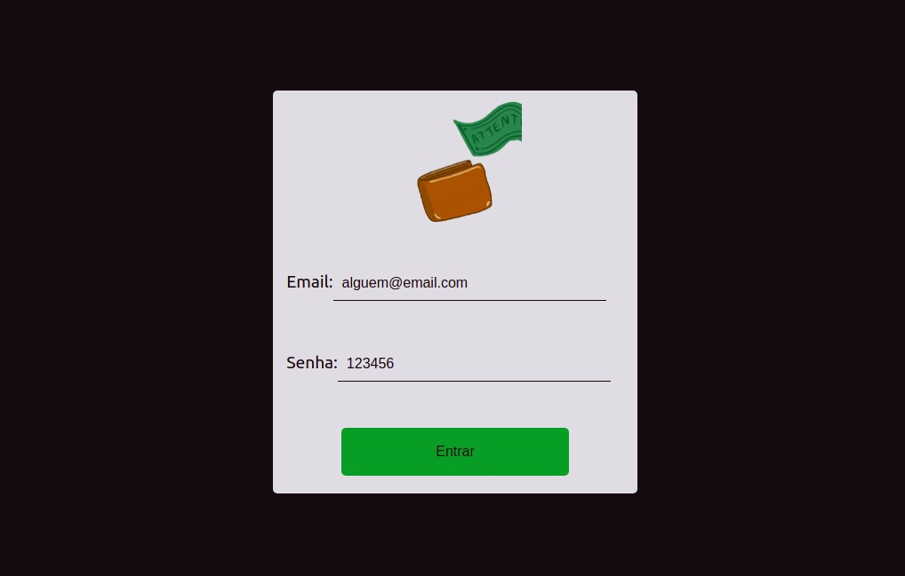
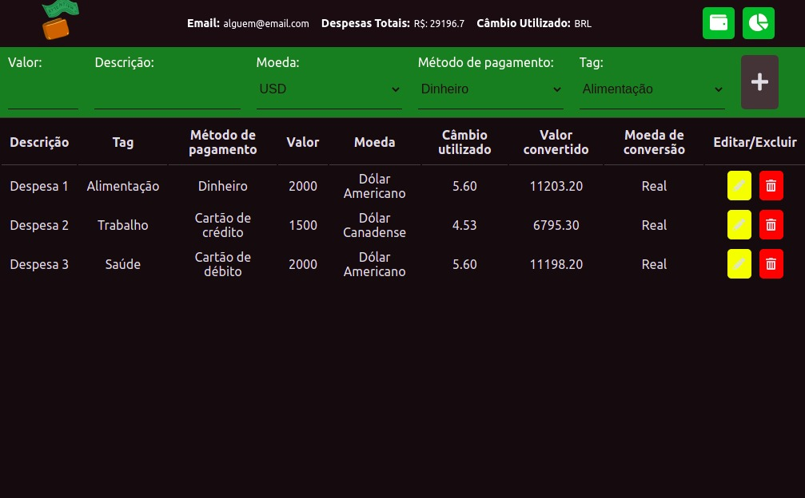
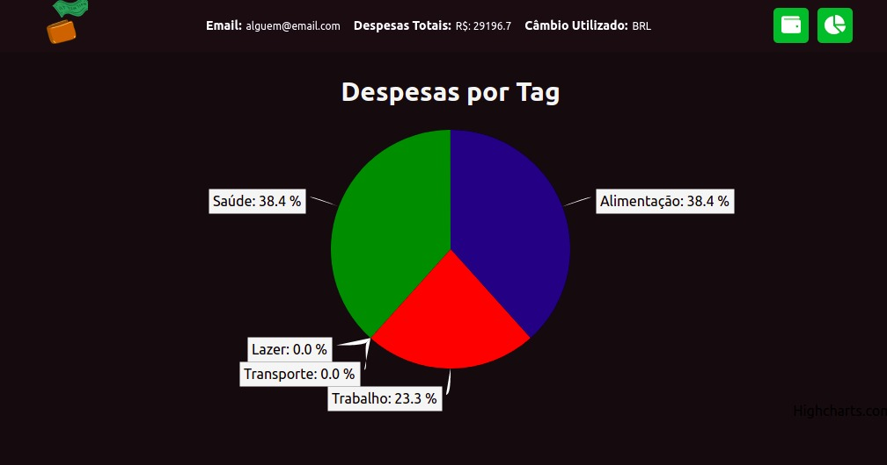

<h1 align="center">
  Projeto Trybe Wallet
</h1>

  <a href="#-tecnologias">Tecnologias</a>&nbsp;&nbsp;&nbsp;|&nbsp;&nbsp;&nbsp;
  <a href="#-projeto">Projeto</a>&nbsp;&nbsp;&nbsp;|&nbsp;&nbsp;&nbsp;
  <a href="#-deploy">Deploy</a>

 

 

  
  
  

## 🚀 Tecnologias

Esse projeto foi desenvolvido com as seguintes tecnologias:

- HTML
- CSS
- React
- Redux
- Highcharts

## 💻 Projeto

O projeto Trybe Wallet tem como objetivo a criação de uma carteira de gastos virtuais para moedas estrangeiras, com conversões das moedas para BRL (R$), através de requisições à API de Conversões **AwesomeAPI** e gerenciamento do estado global da aplicação utilizando Redux. Além disso, utiliza Highcharts para a apresentação dos gráficos.

## 🔖 Deploy

Você pode visualizar a aplicação do projeto através deste link:  
👉 [https://gabrielheb.github.io/Wallet.github.io/](https://gabrielheb.github.io/Wallet.github.io/).

> **Obs:** A aplicação deve ser utilizada acessando-a com o e-mail fictício `alguem@email.com` e senha `123456`.

---

By Gabriel Henrique Eleutério Borges :wave:.
